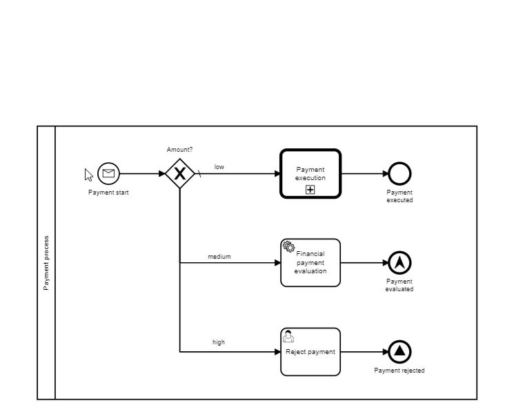

# camunda-modeler-tooltip-plugin

### Description
This plugin adds tooltips to various BPMN-elements revealing some properties and conditional flows.

### How to install
* Enable this plugin by putting the sources into the plugins-directory `{path_to_modeler}/plugins`  
* Alternativley, you can use the folder `C:\Users\{user_name}\AppData\Roaming\camunda-modeler\resources\plugins` (Microsoft Windows) or
`/Users/{user_name}/Library/Application Support/camunda-modeler/plugins` (Mac OS)
* A compressed package of this plugin is available [here](https://github.com/viadee/camunda-modeler-tooltip-plugin/releases)

### Contact
  

### License

